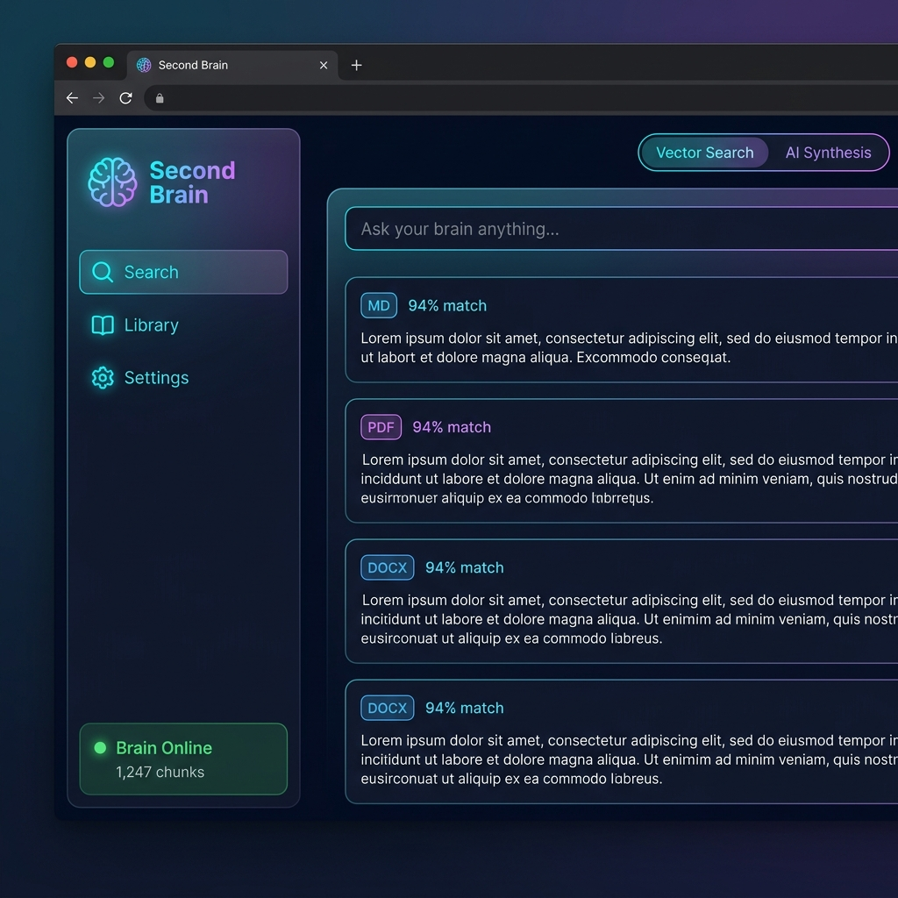

<div align="center">

# 🧠 Second Brain
### A Local-First AI Knowledge Assistant

[](https://python.org)
[](https://react.dev)
[](https://fastapi.tiangolo.com)
[](https://ollama.com)
[](LICENSE)

*Automatically surfaces AI-synthesized insights from your personal documents — 100% local, 100% private.*

<br/>



</div>

---

## ✨ Features

- 📂 **Rich File Ingestion** — PDF, DOCX, Markdown files
- 🤖 **Local LLM Synthesis** — AI-powered summaries & tags via [Ollama](https://ollama.com) (no cloud required)
- 🔍 **Semantic Search** — ChromaDB vector search across your knowledge base
- 📋 **Clipboard Context** — Auto-surfaces relevant notes based on what you copy
- 🖥️ **System Tray App** — Runs silently in the background
- 💅 **Polished Dashboard** — React + Vite frontend with a dark glassmorphism UI

---

## 🏗️ Architecture

```
Second Brain
├── api.py            # FastAPI REST backend
├── main.py           # Entry point & clipboard watcher
├── agent.py          # AI agent logic
├── ingest.py         # File ingestion pipeline
├── synthesizer.py    # LLM summarization & tagging
├── tray.py           # System tray integration
├── popup.py          # Context popup window
└── web/              # React + Vite dashboard
    └── src/
        ├── App.jsx
        ├── App.css
        └── index.css
```

---

## 🚀 Getting Started

### Prerequisites

| Tool | Version | Install |
|------|---------|---------|
| Python | 3.10+ | [python.org](https://python.org) |
| Node.js | 18+ | [nodejs.org](https://nodejs.org) |
| Ollama | latest | [ollama.com](https://ollama.com) |

### 1 — Clone the repo

```bash
git clone https://github.com/YOUR_USERNAME/second-brain.git
cd second-brain
```

### 2 — Install Python dependencies

```bash
pip install -r requirements.txt
```

### 3 — Install a local AI model via Ollama

```bash
ollama pull llama3
```

### 4 — Install frontend dependencies

```bash
cd web
npm install
cd ..
```

### 5 — Run the app

**Windows (easiest):**
```bat
start.bat
```

**Manual:**
```bash
# Terminal 1 – Backend
python api.py

# Terminal 2 – Frontend
cd web && npm run dev
```

Open **http://localhost:5173** in your browser.

---

## 📁 Project Structure Notes

| Path | Tracked? | Reason |
|------|----------|--------|
| `brain_db/` | ❌ No | Auto-generated vector DB (your private data) |
| `notes/` | ❌ No | Your personal documents |
| `web/node_modules/` | ❌ No | Installed via `npm install` |
| `requirements.txt` | ✅ Yes | Python dependency manifest |

---

## 🛠️ Tech Stack

- **Backend**: Python, FastAPI, ChromaDB, Ollama
- **Frontend**: React 18, Vite, Vanilla CSS (glassmorphism design)
- **AI**: Local LLM via Ollama (llama3 / mistral / any model)
- **Vector DB**: ChromaDB (fully local)

---

## 📝 License

MIT © 2025 — feel free to fork, use, and improve!
